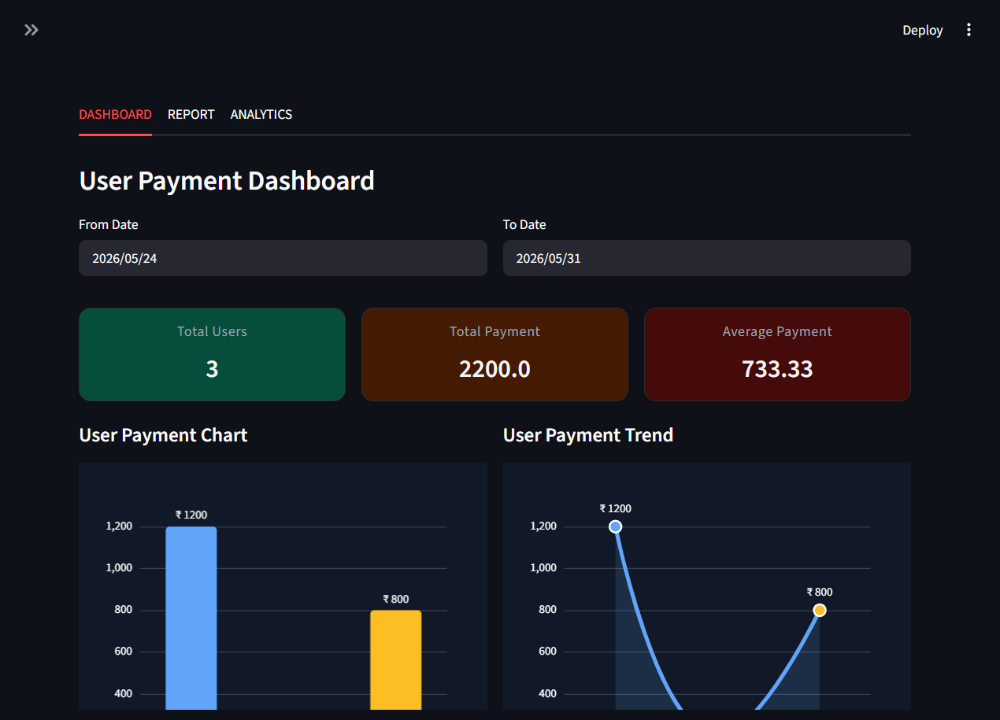
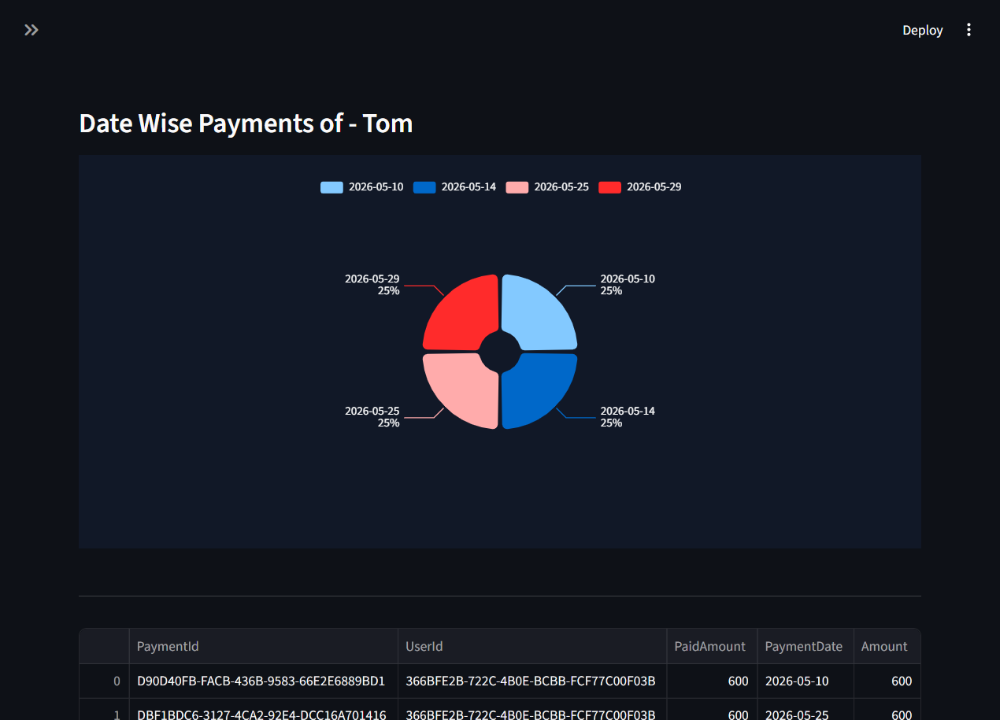

# Streamlit Dashboard Demo

This is an interactive Streamlit dashboard demo for visualizing user payment data from SQL Server database.

## Overview

This project provides a responsive analytics dashboard with:

- Date-range filtering for payment records
- Summary metric cards
- Interactive bar and line charts powered by ECharts
- Searchable user payment table with row selection
- Drilldown to a user-specific payment detail page

## Features

- `App.py` launches the main dashboard with three tab sections
- `components/Dashboard.py` loads payment data from the database, renders charts, and handles user navigation
- `components/Stat_Card.py` displays styled summary metric cards
- `pages/UserPayment.py` shows date-wise payment history for a selected user
- `DB.py` manages the SQL Server connection using `pyodbc`

## Requirements

- Python
- Streamlit
- pandas
- numpy
- plotly
- pyodbc
- streamlit-plotly-events
- streamlit-echarts

Install dependencies with:

```bash
pip install streamlit pandas numpy plotly pyodbc streamlit-plotly-events streamlit-echarts
```

## Setup

1. Update `DB.py` with your SQL Server connection parameters.
2. Ensure the database contains the required stored procedures:
   - `GetAllUserPayments`
   - `GetPaymentByUser`
3. Run the App:

```bash
streamlit run App.py
```

## Project Structure

- `App.py` – main Streamlit application entry point
- `DB.py` – database connection helper
- `components/Dashboard.py` – dashboard page and chart logic
- `components/Stat_Card.py` – UI component for metric cards
- `pages/UserPayment.py` – detailed per-user payment report page

## DB Tables and SP

### Users Table

```sql
CREATE TABLE [streamlit-dashboard].dbo.Users (
    UserId uniqueidentifier NULL,
    UserName varchar(50) NULL,
    Age int NULL
);
```

### Payments Table

```sql
CREATE TABLE [streamlit-dashboard].dbo.Payments (
    PaymentId uniqueidentifier NULL,
    UserId uniqueidentifier NULL,
    PaidAmount decimal(18,2) NULL,
    PaymentDate date NULL
);
```

---

### Stored Procedure: GetAllUserPayments

Returns user-wise total payment amount within a selected date range.

```sql
CREATE PROCEDURE GetAllUserPayments
    @FromDate DATE,
    @ToDate DATE
AS
BEGIN

    SET NOCOUNT ON;

    SELECT
        u.UserId,
        u.UserName,
        u.Age,
        SUM(p.PaidAmount) AS PaidAmount
    FROM Users u
    INNER JOIN Payments p
        ON u.UserId = p.UserId
    WHERE p.PaymentDate BETWEEN @FromDate AND @ToDate
    GROUP BY
        u.UserId,
        u.UserName,
        u.Age
END
GO
```

---

### Stored Procedure: GetPaymentByUser

Returns all payment transactions for a specific user.

```sql
CREATE PROCEDURE GetPaymentByUser
    @UserId UNIQUEIDENTIFIER
AS
BEGIN

    SET NOCOUNT ON;

    SELECT *
    FROM Payments
    WHERE UserId = @UserId
END
GO
```

## Screen Shots

<p align="center">
  
  
</p>
